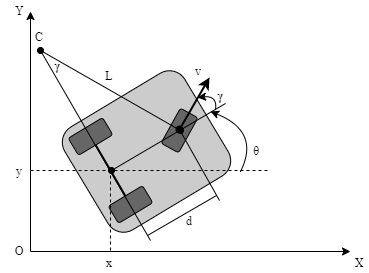
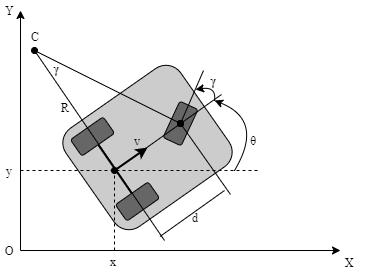
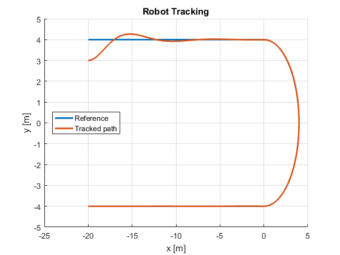
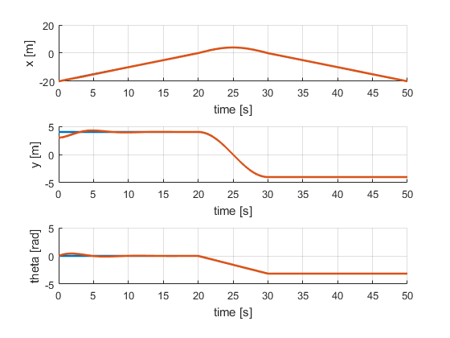
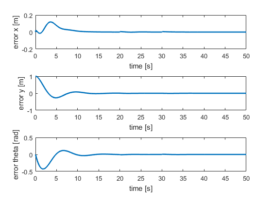
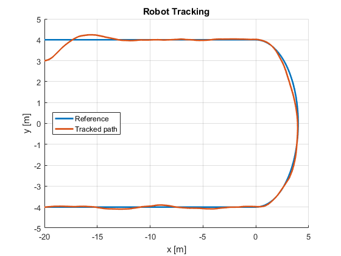
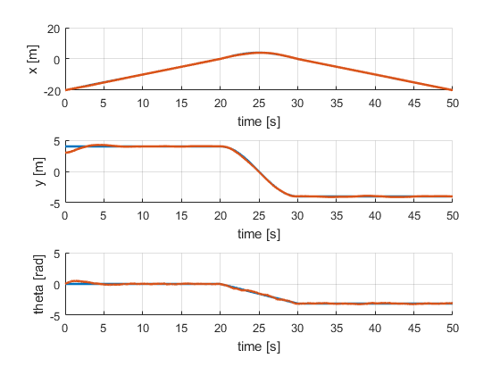
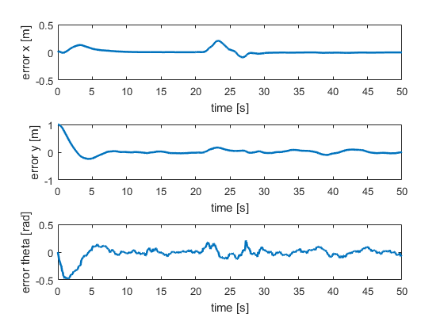
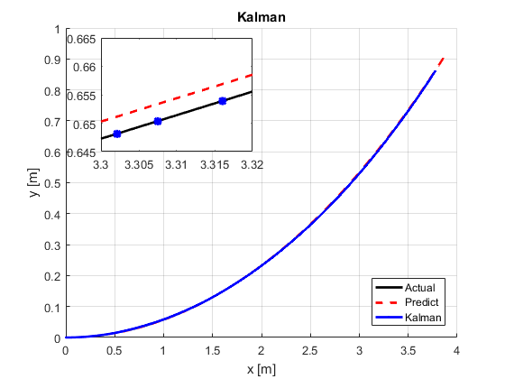
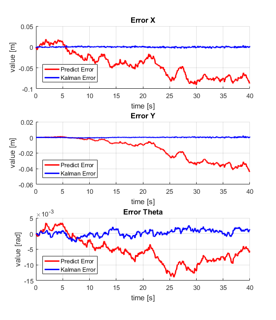

# The Tricycle Mobile Robot
## Two Type of motion controlling
* The Type-1 of motion: Use the front wheel for both driving and steering 

* The Type-1 of motion: Use the rear wheel for driving and the front wheel for steering 


## Lyapunov-based control for Trajectory Tracking
The results of the controller:
### Case 1: Without noise




### Case 2: With added noise to the steering angle




## Extended kalman Filter for Localization



## Installation and Runing
### Installation
Requirement: MATLAB version 2016a or laster
Download and Install:
```
$ git clone https://github.com/duynamrcv/tricycle_robot
```
### Runing
#### Main files
Before runing, please configure the parameter. If you want to run with Type 1 of motrion control, change ```type = 1;``` or ```type = 2;``` for Type 2 of motion control in ```parameter.m```.
First, run the ```parameter.m``` file to load all parameters.
Then, if you want to learn about Tracking problem, select ```tricycle_v2.slx```
If you want to learn about Localization, select ```kalman.m```

### Plot files
We used some files to show the simulation results:
* ```test_model.m``` to plot the information of robots before doing another tasks.
* ```tracking.m```  to plot the tracking results.

### Others files
Other ```.m``` files are the functions used to implementation and ```.mat``` files are the information of input/output.
### Documentation
The problems is presented in the [problem](doc/RBB78E_1_Bai_tap_lon.pdf).<br>
The summary and implement all above problems are available in the [document](doc/rbe3047-report.pdf).
